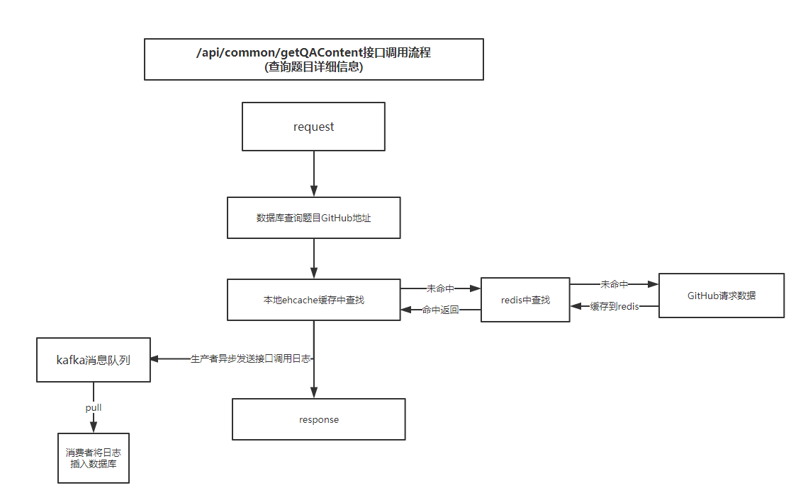

# spring-boot activiti通用框架
> 本项目主要搭建一个基于spring-boot的通用微服务框架，集成了包括spring,mybatis,freemarker,
thymeleaf,redis+ehCache两级缓存,kafka,邮件服务以及spring-activiti流程引擎等服务。

## /api/common/getQAContent 接口调用流程
具体流程如下图所示:

解释:
1. 根据题目id去数据库里面查找对应GitHub的链接地址。

2. 先从本地ehcache缓存中查找改题目对应的详细信息，找到则执行第3步，如果未命中则到redis二级缓存
中查找，命中则将数据存到ehcache缓存中然后执行第3步，如果还没有命中则请求GitHub然后将数据依次存到
两级缓存中，然后执行第三步。

3. 得到题目，返回数据之前将接口的调用日志通过发送者异步发送到kafka中，由消费者在另一个线程中异步消费然后
插入数据库中，整个过程为全异步的。

4. 将数据包装后以统一格式返回。

设计优势：
1. 通过两级缓存机制可以有效地减少网络io操作，从而大大提高系统的并发性能。
2. 将接口调用日志通过kafka消息中间件统一异步收集，然后由消费者异步慢慢消费并插入数据库，可以很好的减少
数据库IO操作，从而减轻数据库压力。

