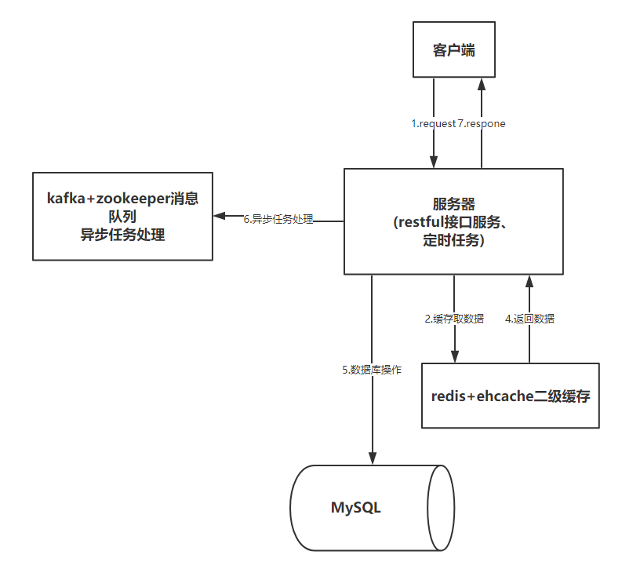

# 互评子系统实现

## 1.开发环境及工具

互评系统开发环境如下所示：

| 工具 / 环境        | 平台名称  |
| ------------- |:-------------:|
| 运行环境      | ubuntu 14.04 |
| 开发语言      | Java、html、JavaScript、Sql、shell 等 |
| 开发框架      | Activiti + spring boot + Mybatis + Freemarker + Maven |
| 数据库      | mysql 5.7.17 + Redis 4.0.1 |
| 分布式缓存      |Redis + Ehcache |
| 消息中间件      | Kafka + Zookeeper |
| 前端框架      | Layui + Bootstrap + Echarts |
| 版本控制      | git |

## 2. 总体架构
互评系统主体框架基于spring boot，结合activiti、Mybatis、Kafka、redis以及前端layui框架等技术，整个系统各个组件之间的
调用关系如下图所示：



整个系统主体分为5个部分，包括客户端、restful接口、缓存、消息队列以及数据库，当客户端请求资源时，首先调用相应的资源
接口，然后根据实际业务情况如果用到缓存则首先到ehcache中找相应的缓存，如果ehcache里面未命中则去redis里面找，要是还没有
命中则直接查数据库然后将返回的结果加入到缓存中供下次请求使用。本系统因为涉及到很多自动化任务（如作业分配、群发邮件、作业以及打分情况
保存到gitlab中），而这些任务大部分都是网络IO，如果直接放到主线程中会导致线程堵塞使整个系统延时非常大，所以本系统中引入了消息队列作为中间件，
而且单独配置了一个线程池供所有的异步任务使用，这样做的结果就是目前整个系统处理请求的速度非常快。

activiti工作流引擎在本系统中处于最核心的位置，所有的操作都是按照之前定义好的流程图来执行的，在本系统中将activiti-spring整合起来，依靠着
spring框架的依赖注入优势，使得整个开发变得比较简单。在本系统中主要用到了一下两个流程图实例，分别为不允许学生申诉和允许学生申诉的流程：


## 3. 登陆对接模块
互评系统相对于整个Open edX 平台是一个独立的模块，要想和edX对接起来协同工作就必须沿用同一套账户体系，所以在用户进入互评
系统之前必须先进行登陆对接，将edX中用户的账户信息传递给互评系统，相当于QQ的第三方授权登陆一样，具体登陆对接流程如下所示:


登陆对接大致可以分为三个步骤，具体每步如何工作的如下：
* 调用登陆对接接口：在用户进入互评系统之前，open edX系统会先调用互评系统提供的对接接口 **api/common/loginAbutment**，参数格式
为：
```
{
  "email": "",
  "userName": "",
  "userType": "",
  "signature": ""
}
```
其中email、userName、userType为用户的基本信息，通过userType可以判断用户是否为管理员用户，然后将基本信息还有事先约定好的
密钥按照一定的规则拼接起来，最后用sha256算法进行签名生成signature，这样可以防止其他人恶意登陆。

* 互评系统处理登陆信息：在接收到open edX传来的登录信息之后，互评系统会按照事先约定的规则将用户信息以同样的方式进行签名操作，
然后校验signature，如果相同则生成一个唯一的uuid，然后以uuid为key将用户信息放到redis中，并设置uuid的过期时间为3s,
因为整个对接过程基本在一瞬间就能完成，这里过期时间设置的短一点可以防止非法用户通过抓包拿到数据后进行重放攻击。

* 页面请求：前面两个步骤进行了登陆对接，互评系统也拿到了用户信息，现在用户可以正式访问互评了，这时open edX 只需要将上一步得
到的uuid作为参数GET请求相应的页面，互评系统这里会先通过自定义的拦截器检测session中是否有用户信息，如果没有则检测请求参数中
是否存在uuid，如果存在则去redis中取出用户信息，然后将所有信息存入到session中，最后返回相应的页面，至此整个登陆对接都已经完成了，
现在用户在互评系统中的所有操作就和在open edX一致了。

## 4. 教师模块
在整个互评系统中存在管理员和学生两种用户角色，教师默认管理员权限，具有流程部署、学生成绩查看、处理学生成绩审核、接口
调用日志以及邮件发送日志查看等功能，下面详细介绍流程部署以及处理学生成绩审核请求的具体实现。

#### 4.1 流程部署
在互评系统中，每部署一个题目就相当于部署了一个流程，这里流程的部分变量是可选的，比如可以部署一个不允许学生提出
老师审核成绩的题目（默认允许），下面是一个流程的具体字段：

```
{
  "courseName": "题目",
  "courseCode": "题号",
  "isAppeal": "是否允许学生申诉",
  "distributeMaxUser": "开始互评人数",
  "timeout": "超时时间",
  "assessmentMinTimeSlot": "最小间隔时间",
  "assessmentMaxTimeSlot": "最大间隔时间"
}
```
通过题号可以确定改题目在GitHub的地址，当学生答题的时候构造相应的地址去GitHub拿到题目，
其中distributeMaxUser该字段表示当人数达到这个值的时候将这些用户放到一个组里面表示这些用户可以进行
互评了，timeout表示当一个用户启动他对应的互评流程时经过多长时间没有互拼则自动结束该流程，
assessmentMinTimeSlot与assessmentMaxTimeSlot是为了当答题人数达到distributeMaxUser时需要检测
这一批人提交作业的时间间隔是否在上面这个时间段内，防止集体作弊。

当上面的字段都满足条件的时候一个流程就部署完成了，此时用户便可以在答题界面看到已经部署的题目了，这里当用户访问题目的
时候因为之前部署的时候只部署了题号，这个时候会构造url去GitHub上面访问题目相关信息，这里为了性能考虑将题目信息存到redis+ehcache缓存
中，极大的提高了访问速度。

#### 4.2 处理学生成绩审核请求


## 5. 学生模块

## 6. RESTful 接口
互评系统部分REST API

| 方法        | URL  | 说明  |
| ------------- |:-------------:|:-------------:|
| GET     | /api/common/getQAContent | GitHub请求题目和答案 |
| GET     | /api/common/selectScheduleTime | 查询指定题目的流程配置 |
| POST     | /api/common/insertScheduleTime | 插入指定题目的流程配置 |
| POST     | /api/common/removeScheduleTime | 删除指定题目的流程配置 |
| GET     | /api/common/selectAllScheduleTime | 查询所有题目的流程配置 |
| GET     | /api/common/selectInvokeLog | 查询接口调用日志 |
| GET     | /api/common/selectEmailLog | 邮件日志查询 |
| GET     | /api/common/getStudentCommitTimeAnalysis | 查询学生提交时间段 |
| GET     | /api/common/getStudentCommitGradeAnalysis | 查询学生成绩分析 |
| POST     | /api/common/loginAbutment | 登陆对接 |
| POST     | /api/user/commitWork | 学生提交作业 |
| GET     | /api/user/selectStudentWorkInfo | 查询学生已经提交的作业 |
| GET     | /api/user/selectWorkListToJudge | 查询需要评论的任务 |
| POST     | /api/user/commitJudgementInfo | 提交互评结果 |
| GET     | /api/user/selectStudentGrade | 学生成绩查询 |
| GET     | /api/user/selectWhoJudgeMe | 查询哪些人评论了我的作业 |
| POST     | /api/user/ackTeacherVerify |  申请让老师批改作业 |
| GET     | /api/user/selectAllTeacherTask | 查询教师需要完成的任务 |
| POST     | /api/user/finishTeacherVerifyTask | 教师完成任务并提交 |


## 7. 邮件提醒模块

## 8.作业分配
作业分配实现伪代码如下所示：
   ``` java
    /**
     * 作业分配算法
     *
     * @param emailList 学生待分配学生列表
     * @return 分配结果集合
     */
    public Map<String, List> distributeTask(List<String> emailList) {
        //返回分配结果集
        Map<String, List> resultMap = new HashMap<>();
        // 每个学生需要批改的份数
        int times = 4;
        int count = emailList.size();
        // 打乱学生顺序
        Collections.shuffle(emailList);
        // 循环遍历
        emailList.forEach(email -> {
            // 取到学生Email对应的id
            int stuId = emailList.indexOf(email);
            List<String> list = new ArrayList<>();
            // 依次取后times个学生作为互评对象
            for (int i = 1; i <= times; i++) {
                int id = stuId + i;
                // 避免空指针异常并取到正确的互评对象
                int result = id >= count ? id - count : id;
                list.add(emailList.get(result));
            }
            resultMap.put(email, list);
        });
        return resultMap;
    }
 ```

 如上代码所述，首先将需要作业分配的所有学生的email作为一个list集合，然后将学生顺序打乱，
 防止多名学生同时提交互评到对方的作业，接着依次遍历集合里面的每个元素，因为邮件地址是唯一的所以这里
 直接用emai索引作为学生的id，然后根据预先设定的每个学生评论作业的份数times分配这名学生id后面的
 times个学生作为互评对象，这里需要注意的是当学生位于列表的后times以内的位置时得依次取队列
 最前面对应位置的学生作为互评对象，这样就把所有学生的互评任务都分配完了，左后返回一个map对应着分配结果。

