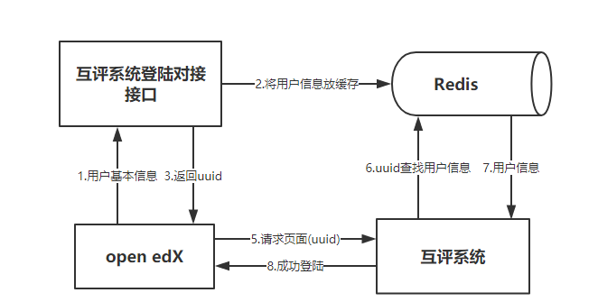

# 互评子系统实现

## 1.开发环境及工具

互评系统开发环境如下所示：

| 工具 / 环境        | 平台名称  |
| ------------- |:-------------:|
| 运行环境      | ubuntu 14.04 |
| 开发语言      | Java、html、JavaScript、Sql、shell 等 |
| 开发框架      | Activiti + spring boot + Mybatis + Freemarker + Maven |
| 数据库      | mysql 5.7.17 + Redis 4.0.1 |
| 分布式缓存      |Redis + Ehcache |
| 消息中间件      | Kafka + Zookeeper |
| 前端框架      | Layui + Bootstrap + Echarts |
| 版本控制      | git |

## 2. 登陆对接模块
互评系统相对于整个Open edX 平台是一个独立的模块，要想和edX对接起来协同工作就必须沿用同一套账户体系，所以在用户进入互评
系统之前必须先进行登陆对接，将edX中用户的账户信息传递给互评系统，相当于QQ的第三方授权登陆一样，具体登陆对接流程如下所示:

## 3. 流程部署模块

## 4. 答题互评模块

## 5. 作业分配算法

## 6. RESTful 接口

## 7. 邮件提醒模块